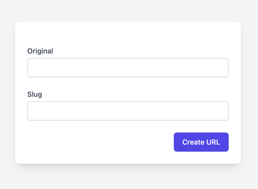

# README

## Problem:

[Build a URL shortner](https://projectbook.code.brettchalupa.com/web-apps/url-shortener.html)

## Solution:

Under the controllers folder I created 2 controllers that solve this problem:

1. `app/controllers/shortner/simple/urls_controller.rb` - The simple/Rails approach
2. `app/controllers/shortner/enterprise/urls_controller.rb` a more enterprise approach(not finished, but working)

The simple controller uses Rails methods to create a short URL, while the enterprise controller uses a service object(a
transaction) to create a short URL and contracts to validate the input.

When you open up the root path of the application you will see 2 optons:

1. Simple URL Shortner
2. Enterprise URL Shortner

Whichever you chose the result is going to be the same, but the way it was implemented is different.

The possible amount of slugs is (26(lowercase letters) + 26(upper case letters) + 10(digits from 0 to 9))^6 = 56^6 =
19,770,609,664 possible slugs.

When creating a short url you will see this form:

* Original - the original URL that you want to shorten(required field)
* Slug - the slug that you want to use(optional field, if left empty a random slug will be generated)